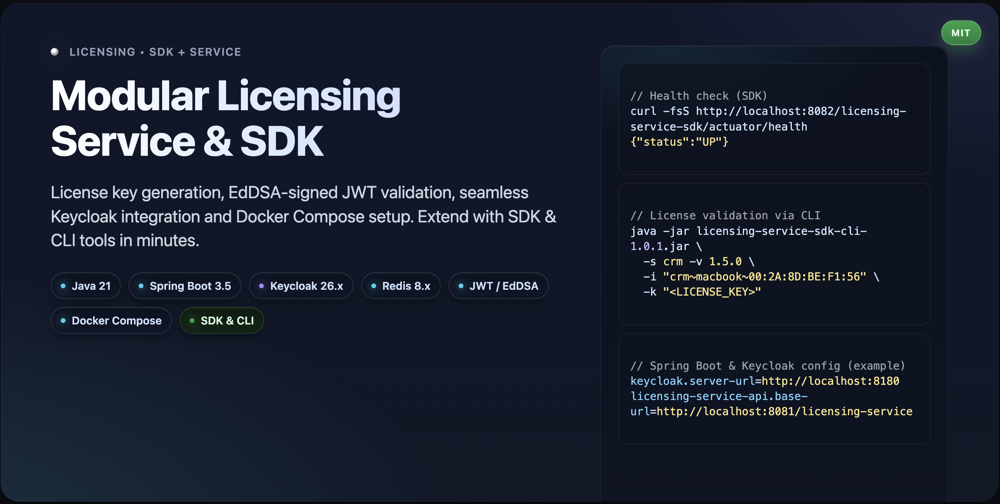
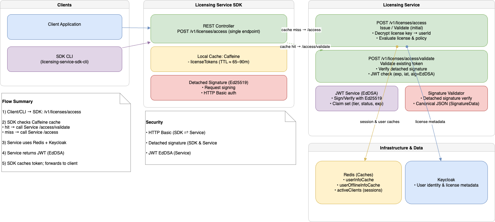

# Welcome to the Licensing Project!

[](https://github.com/bsayli/licensing/actions/workflows/build.yml)
[](https://github.com/bsayli/licensing/releases/latest)
[](https://codecov.io/gh/bsayli/licensing)
[](https://openjdk.org/projects/jdk/21/)
[](https://spring.io/projects/spring-boot)
[](https://www.keycloak.org/)
[](https://redis.io/)
[](https://maven.apache.org/)
[](https://www.docker.com/)
[](https://github.com/ben-manes/caffeine)
[](https://jwt.io/)
[](LICENSE)

<p align="center">
  
  <br/>
  <em>Spring Boot • Keycloak • Redis • EdDSA — Complete licensing framework</em>
</p>

---

> **Why this project?** Licensing is often treated as an afterthought in enterprise applications. This project provides
> a **complete end-to-end licensing framework** built on Spring Boot 3, integrating Keycloak, Redis, and EdDSA to
> standardize issue/validate flows with a **Service**, **SDK**, and **CLI**.

---

<p align="center">
  
  <br/>
  <em>End-to-end license validation flow</em>
</p>

---

### TL;DR – Quickstart

```bash
git clone https://github.com/bsayli/licensing.git
cd licensing/docker-compose
docker-compose up -d
# wait ~45s on first run
```

> Optional (local/dev only): If you want to start **Keycloak + Redis** separately, you can use
`docker-compose.infra.yml`.

---

## Project Purpose

This project provides a **complete licensing framework** for applications, combining secure key generation, detached
digital signatures, and token validation (JWT/EdDSA). It is designed to ensure license authenticity, prevent misuse, and
integrate seamlessly with **Keycloak** for user identity and license metadata.

---

## Subprojects

* **license-generator**: Java project for license key generation, encryption, and cryptographic tooling.
* **licensing-service**: Spring Boot application that issues and validates license tokens.
* **licensing-service-sdk**: Spring Boot application acting as a client SDK (with caching & detached signature) for
  integrating licensing capabilities into external apps.
* **licensing-service-sdk-cli**: Command-line tool for testing and interacting with the licensing service.

---

## Repository Structure

| Directory          | Purpose                                                      |
|--------------------|--------------------------------------------------------------|
| **db**             | Keycloak database backup (`licensing-keycloak.zip`)          |
| **docker-compose** | Docker Compose files for infra + services                    |
| **scripts**        | Utility scripts to run the client (`run_license_sdk_cli.sh`) |

---

## Prerequisites

* Git client installed
* Docker installed and running
* Docker Compose installed and running
* Java (>= 21.x)
* Maven (>= 3.x)

---

## Running the Licensing Service

```bash
cd licensing/docker-compose
docker-compose up -d
```

This starts **Keycloak**, **Redis**, **Licensing Service**, and **Licensing Service SDK** in the background.
Wait \~45 seconds for the services to initialize on the first run.

> For local/dev split mode: you can run `docker-compose -f docker-compose.infra.yml up -d` to only start Keycloak +
> Redis.

---

## Running the License Validation Tool via Docker

```bash
cd licensing/docker-compose/client
docker-compose up
```

Logs should confirm validation:

```text
licensing-service-sdk-cli | INFO License validated successfully.
licensing-service-sdk-cli | INFO Token: <JWT_TOKEN>
licensing-service-sdk-cli | INFO Message: License is valid
```

---

## Running the License Validation Tool Directly (Optional 1)

```bash
cd licensing/licensing-service-sdk-cli
mvn clean package
cd target
java -jar licensing-service-sdk-cli-1.0.1.jar -s crm -v 1.5.0 -i "crm~macbook~00:2A:8D:BE:F1:56" -k "<LICENSE_KEY>"
```

---

## Running the License Validation Tool with Script (Optional 2)

```bash
cd licensing/scripts
chmod +x run_license_sdk_cli.sh
./run_license_sdk_cli.sh -s billing -v 2.0.0 -i "billing~macbook~00:2A:8D:BE:F1:56" -k "<LICENSE_KEY>"
```

---

## Notes

* CLI examples must always be provided **on a single line**.
* If parameters contain spaces or special characters, they should be enclosed in quotes (`"..."`).

---

## Security Note

Demo configuration files contain inline secrets in `application.yml`. In production, **HashiCorp Vault** or another
secret manager should be used. Vault integration is part of the **roadmap**.

---

## Feedback & Questions

If you notice any issues in this documentation or have suggestions for improvements, feel free to open an **Issue** or a
**Discussion**.

---

## 🗺️ Roadmap

* [ ] Move sensitive configs to **HashiCorp Vault** for secure secrets management
* [ ] Extend **Keycloak integration** to manage licenses (create, update, revoke) via dedicated endpoints

---

## ⭐ Support

If you found this project useful, please consider giving it a star ⭐ on GitHub — it helps others discover it too!

---

## Related Modules (Quick View)

| Module                          | Purpose                                    | Quick Command                                                           |
|---------------------------------|--------------------------------------------|-------------------------------------------------------------------------|
| **docker-compose (all-in-one)** | Keycloak + Redis + Service + SDK           | `cd docker-compose && docker-compose up -d`                             |
| **docker-compose.infra** (opt)  | Keycloak + Redis (infra only, dev/testing) | `cd docker-compose && docker-compose -f docker-compose.infra.yml up -d` |
| **licensing-service**           | REST API for issuing and validating tokens | (started via all-in-one compose)                                        |
| **licensing-service-sdk**       | Client SDK for integration                 | `mvn clean package`                                                     |
| **licensing-service-sdk-cli**   | CLI demo client                            | `java -jar ... -k ... -s ...`                                           |
| **license-generator**           | Key & signature tooling                    | `mvn exec:java -Dexec.mainClass=...`                                    |
