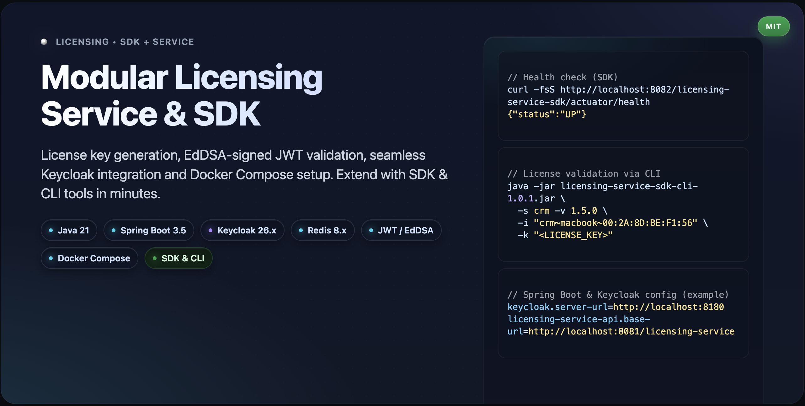

# Licensing Project (2.0.0 – Contract-First)

[](https://github.com/bsayli/licensing/actions/workflows/build.yml)
[](https://github.com/bsayli/licensing/releases/latest)
[](https://codecov.io/gh/bsayli/licensing)
[](https://openjdk.org/projects/jdk/21/)
[](https://spring.io/projects/spring-boot)
[](https://www.keycloak.org/)
[](https://redis.io/)
[](https://maven.apache.org/)
[](https://www.docker.com/)
[](https://jwt.io/)
[](LICENSE)

<p align="center">
  
  <br/>
  <em>Spring Boot • Keycloak • Redis • EdDSA • Contract‑First APIs</em>
</p>

---

## Why this project?

Licensing is usually an afterthought. This repository provides a **complete, production‑grade licensing framework** with a **contract‑first architecture**:

* **Service** → canonical source of truth
* **Generated Client** → contract projection (no drift)
* **Agent** → orchestration + caching + signatures
* **CLI** → runnable demo / ops tool

Built with **Spring Boot 3.5**, **Keycloak**, **Redis**, and **Ed25519 (EdDSA)**.

---

## What changed in 2.0.0?

### Contract‑First (OpenAPI Generics)

* **Java contract = source of truth**
* OpenAPI is a **projection**, not the origin
* **Generated client** via generics‑aware templates (no model duplication)

### Unified Envelope

* Success: `ServiceResponse<T>`
* Error (transport): **RFC 9457 ProblemDetail**
* Error (agent boundary): **AgentErrorResponse (framework‑agnostic)**

### Clean Boundaries

* Service → no framework leakage outside
* Client → maps ProblemDetail → `ApiProblemException`
* Agent → maps remote errors → stable public contract

---

<p align="center">
  
  <br/>
  <em>End‑to‑end flow (contract‑first)</em>
</p>

---

## Architecture Overview

```
Application
   ↓
Licensing Agent (orchestration)
   ↓
Generated Client (contract projection)
   ↓
Licensing Service (source of truth)
   ↓
Keycloak + Redis
```

### Key ideas

* **Service owns semantics**
* **Client is generated** (no handwritten drift)
* **Agent owns orchestration concerns** (retry, cache, signature)

---

## Modules

| Module                       | Purpose                                                |
| ---------------------------- | ------------------------------------------------------ |
| **license-generator**        | Key + signature tooling (AES, Ed25519, JWT validation) |
| **licensing-service**        | Contract‑first REST API (issue / validate)             |
| **licensing-service-client** | Generated client (OpenAPI generics)                    |
| **licensing-agent**          | Orchestration layer (cache + signature + retry)        |
| **licensing-agent-cli**      | CLI demo / ops tool                                    |

---

## TL;DR – Quickstart

```bash
cd docker-compose/server && docker-compose up -d
# wait ~45s
cd ../client && docker-compose up
```

Expected:

```
License validated successfully
Token: <JWT>
```

---

## Running the System

### Start infrastructure + service + agent

```bash
cd docker-compose/server
docker-compose up -d
```

### Run CLI (docker)

```bash
cd docker-compose/client
docker-compose up
```

---

## Contract Model (2.0.0)

### Success

```json
{
  "data": { ... },
  "meta": {
    "serverTime": "..."
  }
}
```

### Error (transport)

* RFC 9457 ProblemDetail

### Error (agent public API)

```json
{
  "errorCode": "...",
  "message": "...",
  "errors": []
}
```

---

## Key Features

* JWT (Ed25519) license tokens
* Detached request signatures
* Keycloak‑backed license metadata
* Redis caching (service) + Caffeine (agent)
* Contract‑first API (no drift)
* Generated client (type‑safe)

---

## Repository Structure

```
licensing/
├─ license-generator/
├─ licensing-service/
├─ licensing-service-client/
├─ licensing-agent/
├─ licensing-agent-cli/
├─ docker-compose/
├─ scripts/
└─ db/
```

---

## Prerequisites

* Java 21
* Maven 3.x
* Docker + Docker Compose

---

## Keycloak Setup

See:

```
docs/KEYCLOAK_CONFIG.md
```

---

## Security Notes

* Demo configs include inline secrets → **do not use in production**
* Recommended: **Vault / secret manager**

---

## Roadmap

* Vault integration (secrets)
* License lifecycle APIs (Keycloak management)
* Advanced policy controls

---

## Design Principles

* Contract‑first, not code‑first
* No framework leakage across boundaries
* Deterministic client generation
* Clear separation: mechanism vs policy

---

## Related Docs

* `licensing-service/README.md`
* `licensing-service-client/README.md`
* `licensing-agent/README.md`
* `licensing-agent-cli/README.md`
* `license-generator/README.md`

---

## License

MIT License

---

## Final Note

This repo is not just a demo.

It is a **reference architecture** for:

* contract‑first APIs
* generated clients
* clean service/agent separation
* real‑world licensing systems