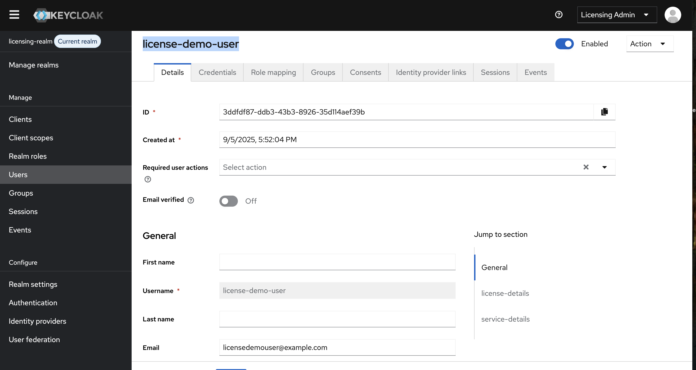
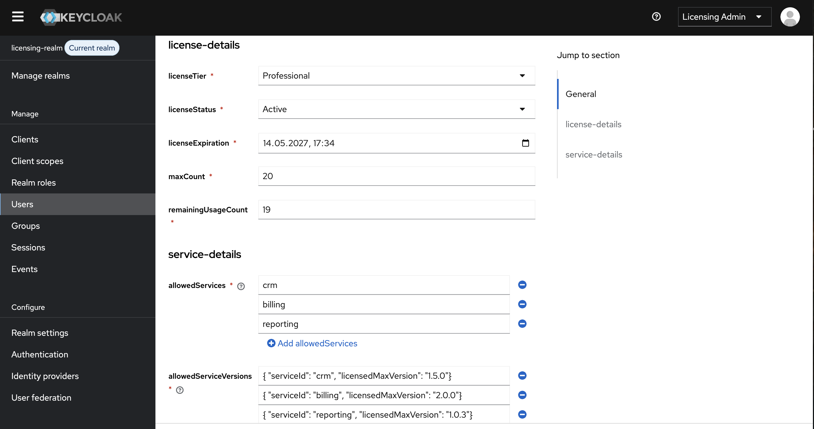
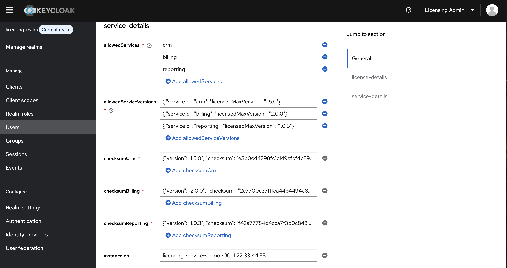

# Keycloak Configuration for Licensing Project

This document describes the **Licensing Realm** configuration in Keycloak that powers the licensing framework. It covers the demo realm, users, attributes, and groups used to store license information. This setup is required to ensure that the **Licensing Service** can issue and validate tokens against user license metadata.

---

## Accessing Keycloak

* **URL**: [http://localhost:8180/](http://localhost:8180/)
* **Admin credentials** (demo only):

    * Username: `licensing-admin`
    * Password: `admin123`
* **Realm**: `licensing-realm`

Once logged in, switch to `licensing-realm` via **Manage Realms**.

---

## Demo User

A sample user is pre-configured for testing:

* **Username**: `license-demo-user`
* **Email**: `licensedemouser@example.com`
* **User ID**: `3ddfdf87-ddb3-43b3-8926-35d114aef39b`
* **License Tier**: `Professional`
* **License Status**: `Active`
* **License Expiration**: `2027-05-14T17:34:00`
* **Max Count**: `20`
* **Remaining Usage Count**: `19`
* **Allowed Services**: `crm`, `billing`, `reporting`
* **Allowed Service Versions**:

    * crm ≤ 1.5.0
    * billing ≤ 2.0.0
    * reporting ≤ 1.0.3
* **Checksums**:

    * crm: `e3b0c44298fc1c149afbf4c8996fb92427ae41e4649b934ca495991b7852b8a5`
    * billing: `2c7700c37f1fca44b4494a82c4d422a2c40e0c3a7e3e8a5b27b43c4d9242c771`
    * reporting: `f42a77784d4cca7f3b0c848929b0febf2c2f4a82e1a13fda29b334af508e2c0f`
* **Instance IDs**: `licensing-service~demo~00:11:22:33:44:55`

### Demo User in Keycloak (Screenshots)

Below screenshots illustrate how the demo user (`license-demo-user`) is configured in Keycloak.

**General Section**

**License Details**

**Service Details**

---

## License Attributes

The following custom attributes are used to store license metadata in Keycloak.

| Attribute                | Group           | Type         | Example Value(s)                                                   |
| ------------------------ | --------------- | ------------ | ------------------------------------------------------------------ |
| `licenseTier`            | license-details | Enum         | `Starter`, `Professional`, `Enterprise`                            |
| `licenseStatus`          | license-details | Enum         | `Active`, `Inactive`, `Trial`, `Suspended`, `Expired`              |
| `licenseExpiration`      | license-details | DateTime     | `2027-05-14T17:34:00`                                              |
| `maxCount`               | license-details | Integer      | `20`                                                               |
| `remainingUsageCount`    | license-details | Integer      | `19`                                                               |
| `allowedServices`        | service-details | Multi-Select | `crm`, `billing`, `reporting`                                      |
| `allowedServiceVersions` | service-details | JSON         | `{ "serviceId": "crm", "licensedMaxVersion": "1.5.0" }`            |
| `checksumCrm`            | service-details | String       | `e3b0c44298fc1c149afbf4c8996fb92427ae41e4649b934ca495991b7852b8a5` |
| `checksumBilling`        | service-details | String       | `2c7700c37f1fca44b4494a82c4d422a2c40e0c3a7e3e8a5b27b43c4d9242c771` |
| `checksumReporting`      | service-details | String       | `f42a77784d4cca7f3b0c848929b0febf2c2f4a82e1a13fda29b334af508e2c0f` |
| `instanceIds`            | service-details | Multi-Value  | `licensing-service~demo~00:11:22:33:44:55`                         |

---

## Attribute Groups

Attributes are organized into logical groups:

* **User Metadata**: Standard Keycloak user metadata (`firstName`, `lastName`, `email`, etc.)
* **License Details**: License-related metadata such as tier, status, expiration, and usage counts.
* **Service Details**: Service-level entitlements, allowed versions, checksums, and bound instance IDs.

---

## Usage in Licensing Service

* The **Licensing Service** queries Keycloak for user attributes when validating a license key.
* Attributes like `licenseExpiration`, `licenseStatus`, and `allowedServices` are enforced during token issuance.
* Checksums and instance IDs provide request-level integrity validation.

---
